# 🎟️ Event Management Platform (+Vibe)

**Полноценная платформа для организации мероприятий и бронирования билетов**

---

## 📋 О проекте

**Event Management Platform** — это веб-приложение для онлайн-бронирования билетов на мероприятия (аналог Ticketpro/Kvitki.by, но для среднего и малого бизнеса). Платформа закрывает полный цикл: от создания события и выбора мест в зале до генерации QR-билетов, обработки платежей и постинговой активности.

---

## 🎯 Ключевые возможности

| Функция | Описание |
|---------|----------|
| 👥 **Ролевая модель** | Администратор, Организатор, Посетитель — разные уровни доступа |
| 🎪 **Управление мероприятиями** | CRUD для событий, настройка схем залов, типы билетов (VIP/Стандарт) |
| 💺 **Интерактивное бронирование** | Схема зала с блокировкой мест в реальном времени |
| 🔐 **Безопасность** | JWT-аутентификация, BCrypt, защита от SQL-инъекций |
| 🎫 **Билетная система** | Генерация QR-кодов на каждый билет |
| 📧 **Email-рассылка** | Приветственные письма, верификация, уведомления |
| ⭐ **Отзывы и рейтинги** | Оценка мероприятий, модерация отзывов |
| 🔔 **Уведомления** | Система оповещений пользователей |
| 🗺️ **Карты Google** | Отображение места проведения |

---

## 🛠️ Технологический стек

### Backend

| Технология | Назначение |
|------------|------------|
| **C# / .NET 8** | Основной язык программирования |
| **ASP.NET Core MVC** | Веб-фреймворк, REST API |
| **Entity Framework Core** | ORM для работы с БД |
| **JWT** | Аутентификация и авторизация |
| **BCrypt** | Хеширование паролей |
| **SMTP** | Email-рассылка |

### Frontend

| Технология | Назначение |
|------------|------------|
| **React 18** | Библиотека для UI |
| **TypeScript** | Типизация |
| **Tailwind CSS** | Стилизация |
| **Framer Motion** | Анимации |
| **React Router DOM** | Маршрутизация |
| **Lucide React** | Иконки |

### База данных

| Технология | Назначение |
|------------|------------|
| **PostgreSQL 16** | Основная СУБД |
| **Npgsql** | Провайдер для EF Core |

---
### Основные таблицы

| Таблица | Описание |
|---------|----------|
| `Users` | Пользователи (имя, email, хеш пароля, верификация) |
| `Events` | Мероприятия (название, дата, время, место, цена, категория) |
| `Seats` | Места (ряд, номер, статус, тип, цена) |
| `UserTickets` | Билеты пользователей (QR-код, статус использования) |
| `Orders` | Заказы (номер, сумма, статус) |
| `Payments` | Платежи (сумма, способ, статус, транзакция) |
| `Feedbacks` | Отзывы (рейтинг, комментарий, модерация) |
| `Notifications` | Уведомления пользователей |
| `ContactMessages` | Сообщения обратной связи |

---

## 🖼️ Скриншоты

| № | Страница | Скриншот |
|---|----------|----------|
| 1 | Главная (Hero-секция) |  |
| 2 | Список мероприятий | 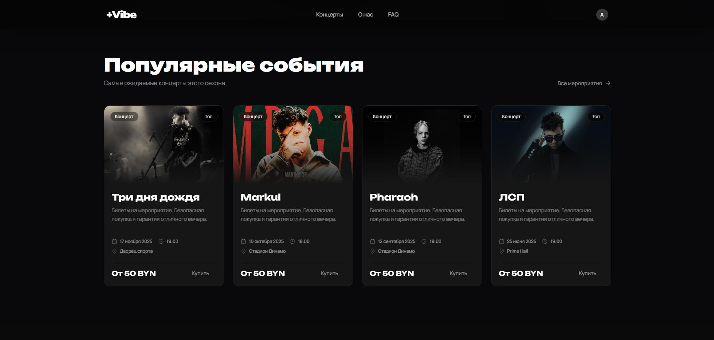 |
| 3 | Регистрация | 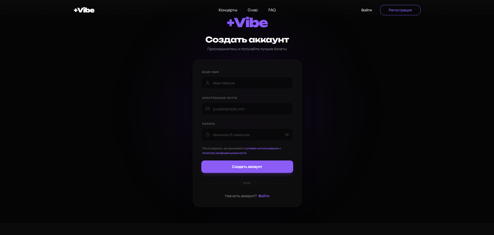 |
| 4 | Авторизация | 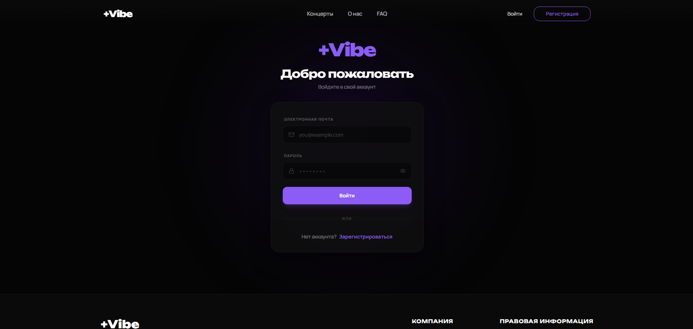 |
| 5 | Детали мероприятия | 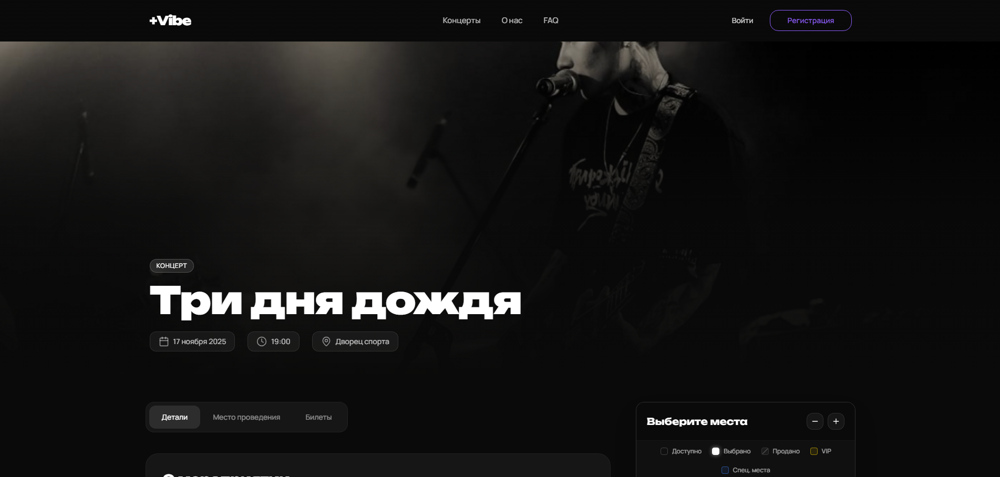 |
| 6 | Схема зала | 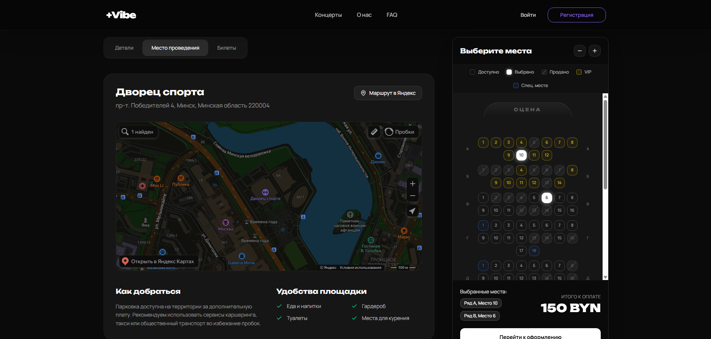 |
| 7 | Оформление билетов | 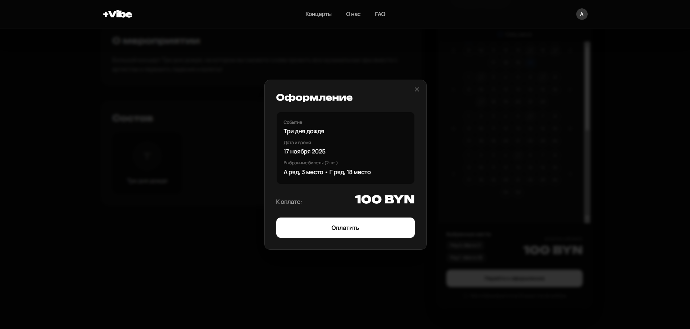 |
| 8 | Профиль пользователя | 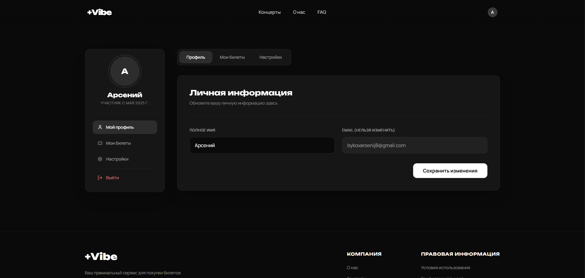 |
| 9 | Мои билеты (QR-коды) | 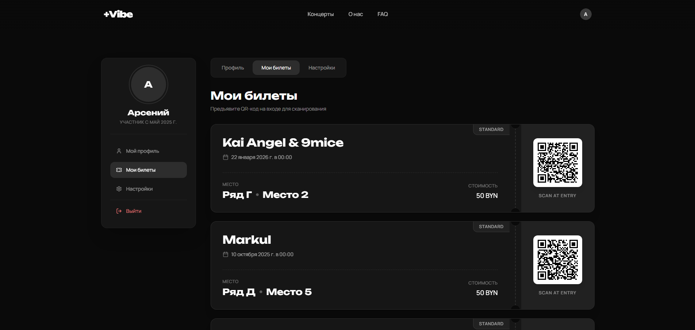 |
| 10 | Настройки | 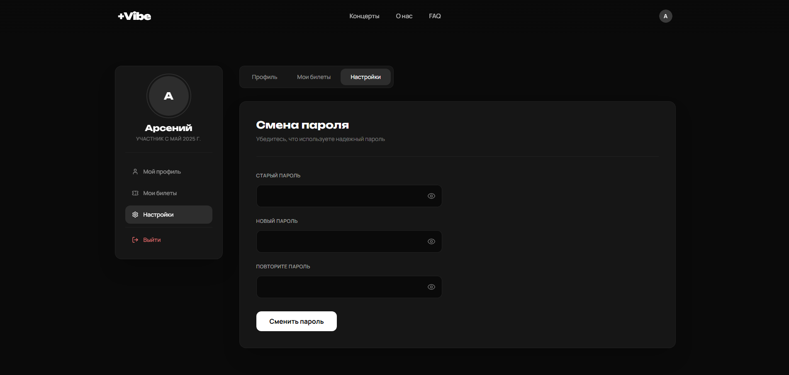 |
| 11 | Обратная связь | 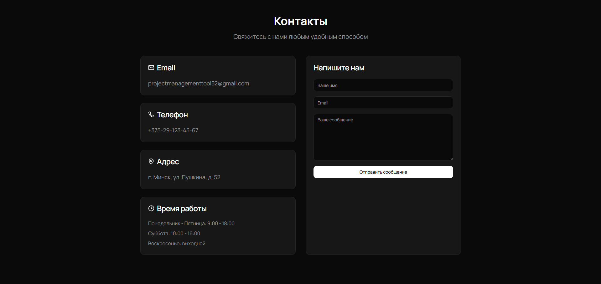 |
| 12 | Email-рассылка | 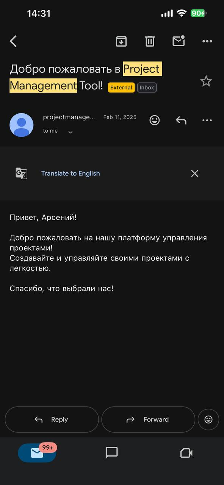 |
